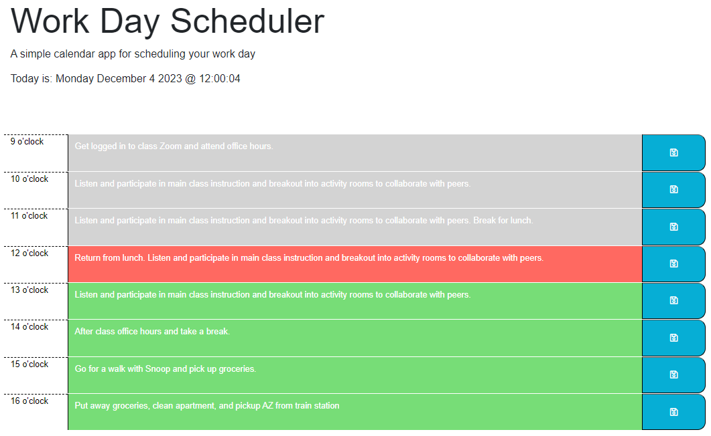

# Work Day Scheduler
This app will allow you to enter and store tasks for your workday and color code entries based on whether they are in the past, present, or future.

## Purpose
Create a simple calendar application that allows a user to save events for each hour of a typical working day (9am–5pm).

## Deployed Webpage Link
https://jabrams513.github.io/work-day-scheduler/

## User Story

AS AN employee with a busy schedule

I WANT to add important events to a daily planner

SO THAT I can manage my time effectively

## Acceptance Criteria

GIVEN I am using a daily planner to create a schedule

WHEN I open the planner

THEN the current day is displayed at the top of the calendar

WHEN I scroll down

THEN I am presented with time blocks for standard business hours of 9am to 5pm

WHEN I view the time blocks for that day

THEN each time block is color-coded to indicate whether it is in the past, 
present, or future

WHEN I click into a time block

THEN I can enter an event

WHEN I click the save button for that time block

THEN the text for that event is saved in local storage

WHEN I refresh the page

THEN the saved events persist

## Screenshot
Please refer to the following screenshot as a reference for the web application's appearance and functionality:

## Code Sources and Collaborators
I had the opportunity to collaborate with my peer Mustapha. We checked our work with one another.

In addition, I received feedback from my instructor, Diego, my TA, Andrew, as well as my tutor, Corey.

All code used was self-generated or otherwise gathered from class materials.
